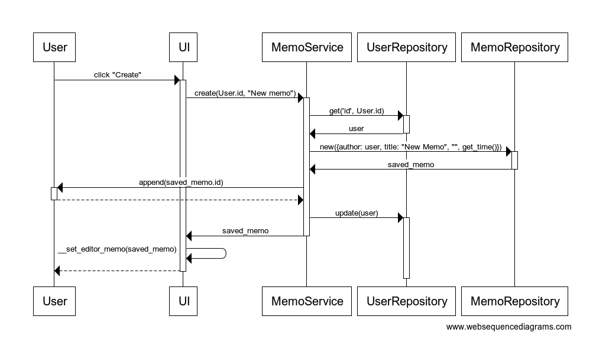

# Arkkitehtuurikuvaus

## Sovelluksen rakenne

Muistio-sovelluksen rakenne koostuu kerrosarkkitehtuurista, jossa _entities_-pakkauksessa on tietokannan kohteiden kuvauksessa käytettäviä luokkia, _repositories_-pakkauksessa tietokantainteraktiot sisältävät luokat, _services_-pakkauksessa sovelluslogiikasta vastaavat luokat ja _ui_-pakkauksessa käyttöliittymästä vastaavat luokat.

## Käyttöliittymän rakenne

Muistio-sovelluksen graafinen käyttöliittymä koostuu kolmesta erillisestä pääluokasta, kirjautumisesta vastaavasta luokasta, asetusvalikosta vastaavasta luokasta ja muistioiden katselemisesta sekä muokkaamisesta vastaavasta luokasta. Näistä näkymistä kirjautuminen ja muistioiden käsitteleminen eivät voi näkyä yhtä aikaa, mutta asetusvalikkoa voidaan katsella molempien kanssa. Graafinen käyttöliittymä on paketoitu _GUI_-luokkaan.

Käyttöliittymä on eristetty sovelluslogiikasta ja käyttöliittymä toimiikin sovelluksen kanssa ainoastaan keskustelemalla services-pakkauksen luokkien kanssa.

## Sovelluslogiikka

Sovelluslogiikassa tietokannan kohteet kuvataan _Memo_, _User_ ja _Image_ -luokkien avulla. Nämä vastaavat tiedon esittämisestä tietokannan edellyttämällä tavalla sovelluksessa.

Sovelluksen toiminnasta sovelluslogiikka tasolla vastaavat muistioiden toiminnallisuuksista vastaava _MemoService_, käyttäjien hallinnoinnista vastaava _UserService_, valokuvien hallinnoinnista vastaava _ImageService_ ja tiedostojen käsittelemisestä vastaava _FileService._ Käyttöliittymä käyttää näiden palveluiden tarjoamia funktioita sovelluksen toiminnallisuuksien toteuttamiseen.

Sovelluslogiikat käsittelevät pitkäaikaissäilytyksessä olevia tietoja joko tietokannasta tai laitteen tiedostojärjestelmästä repositories-pakkauksen luokkien kautta, jotka injektoidaan sovelluslogiikalle sen konstruktoinnin aikana.

## Tiedon pysyväistallentaminen

Repositories-pakkauksen muistioiden hallinnoinnista vastaava MemoRepository, valokuvien hallinnoinnista vastaava ImageRepository, tiedostojen käsittelystä vastaava FileRepository ja käyttäjien hallinnoinnista vastaava UserRepository huolehtivat sovelluksen interaktiosta tiedostojärjestelmän ja käytetyn Mongo-tietokannan kanssa. MemoRepository, UserRepository ja ImageRepository käsittelee ja hallinnoi tietoa Mongo-tietokannassa ja FileRepository hallinnoi laitteen tiedostojärjestelmästä käytettyjä tietoja.

Sovelluksen juurikansioon sijoittuva konfiguraatiotiedosto .env määrittelee sovelluksen käytettävät asetukset sekä pitää huolta tietokantapalvelimen tiedoista.

### Tietokantakuvaus

#### Memo

- author: viittaus muistion kirjoittajaan, pakollinen. Haettaessa tietokannasta, palautuu tähän kirjoittajaa vastaava User-olio.
- title: muistion otsikko merkkijonona, pakollinen ja maksimipituus 50 merkkiä.
- content: muistion sisältö merkkijonona.
- date: muistion luomisaika, pakollinen.

#### User

- firstname: käyttäjän etunimi merkkijonona, pakollinen ja maksimipituus 25 merkkiä.
- lastname: käyttäjän sukunimi merkkijonona, pakollinen ja maksimipituus 25 merkkiä.
- username: käyttäjän käyttäjätunnus merkkijonona, pakollinen, maksimipituus 40 merkkiä ja tulee olla uniikki.
- password: käyttäjän salasana merkkijonona, tallennetaan salattuna merkkijonona.
- memos: listaus käyttäjän muistioista, oletuksena tyhjä lista.

#### Image

- author: viittaus valokuvan tallentajaan, pakollinen. Haettaessa tietokannasta, palautuu tähän kirjoittajaa vastaava User-olio.
- name: kuvan nimi merkkijonona, pakollinen ja maksimipituus 50 merkkiä.
- image: kuvan sisältö tallennnettuna base64-koodattuna merkkijonona.
- filetype: kuvan tiedostotyyppi merkkijonona, pakollinen.
- width: kuvan leveys piirrettäessä se käyttölittymässä, kokonaisluku.

## Sovelluksen päätoiminnallisuudet

Alla on kuvattu sovelluksen toimintaa sovelluksen eniten käytetyimmissä toiminnallisuuksissa sekvenssikaavioiden avulla.

### Uuuden muistion luominen

Sekvenssikaaviossa kuvataan mitä tapahtuu käyttäjän painettua uuden muistion ikkunassa "Create"-nappia.

Käyttöliittymä kutsuu muistioiden sovelluslogiikassa muistioiden luomisesta vastaavaa create-metodia. Tämä metodi hakee ensin käyttäjien hakemisesta tietokantayhteyden ylitse vastaavalla get-metodilla muistion kirjoittajan. Tämän jälkeen create-metodi kutsuu muistioiden tietokantaan tallentamisesta vastaavaa new-metodia ja saa onnistuttua palautuksena tallennetun muistion. Tämän jälkeen tämä muistion id lisätään kirjoittajan muistioihin ja tallennetaan tietokantaan käyttäjien päivittämisestä vastaavalla update-metodilla. Lopuksi käyttöliittymä asettaa editorin muistioksi tallennetun muistion. Tarvittaessa vaihtaa vielä näkyväksi näkymäksi muistioeditorin.
