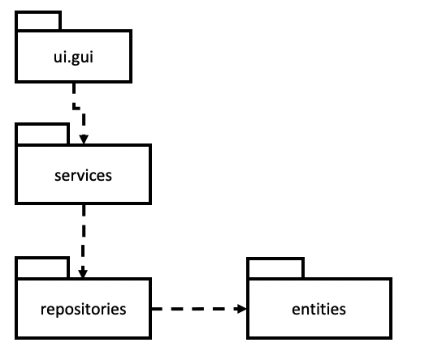
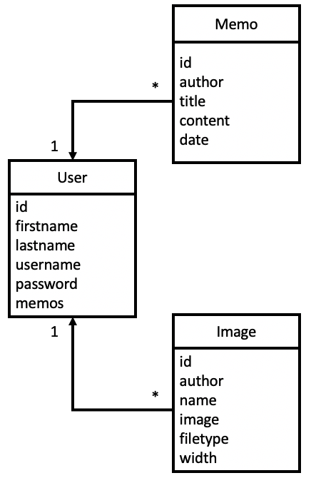
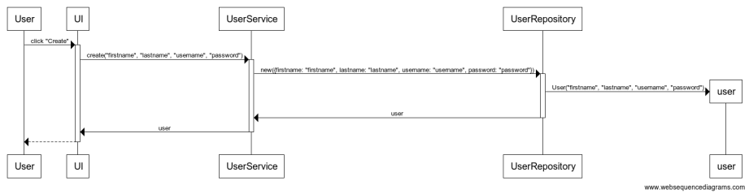
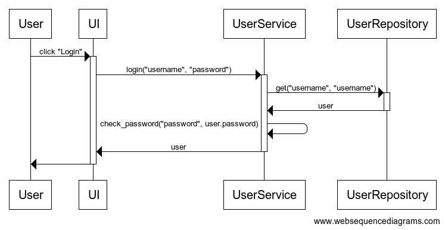
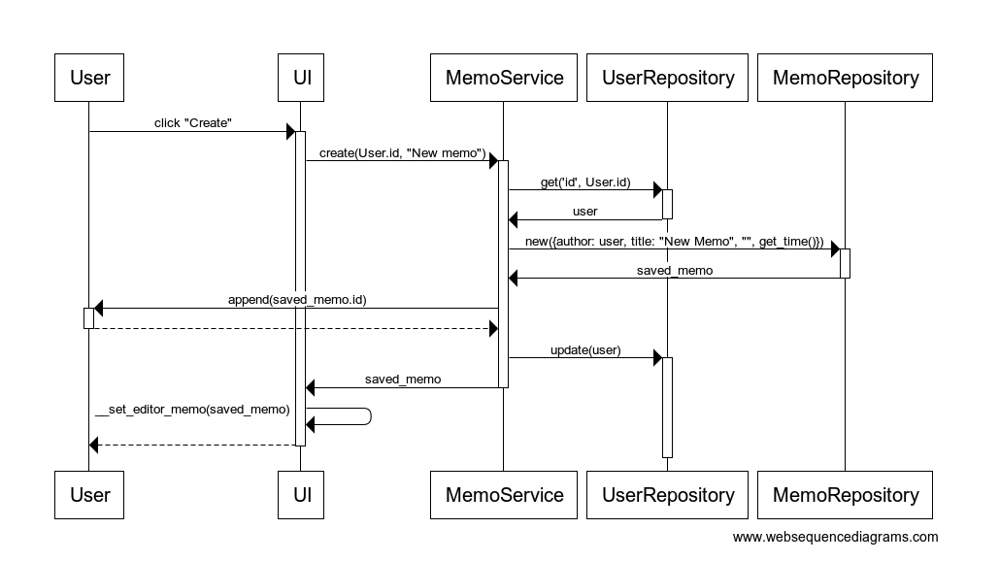
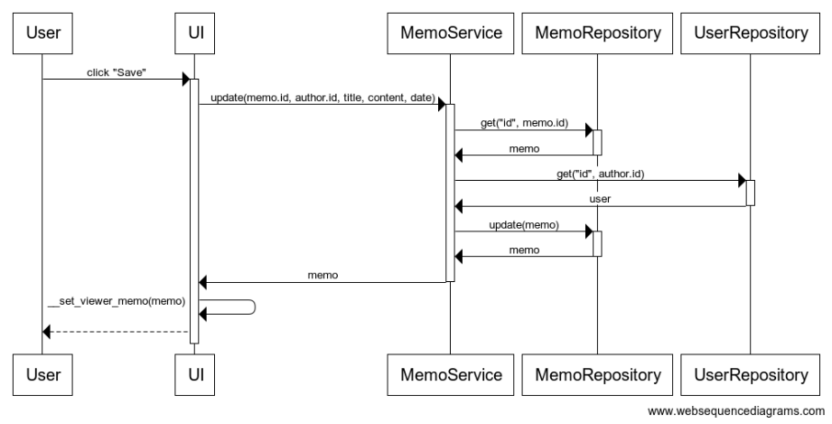
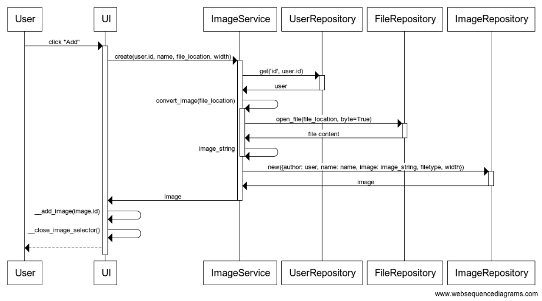

# Arkkitehtuurikuvaus

## Sovelluksen rakenne

Muistio-sovelluksen rakenne koostuu kerrosarkkitehtuurista, jossa [`entities`](https://github.com/FinThunderstorm/ohte/tree/master/src/entities)-pakkauksessa on tietokannan kohteiden kuvauksessa käytettäviä luokkia, [`repositories`](https://github.com/FinThunderstorm/ohte/tree/master/src/repositories)-pakkauksessa tietokantainteraktiot sisältävät luokat, [`services`](https://github.com/FinThunderstorm/ohte/tree/master/src/services)-pakkauksessa sovelluslogiikasta vastaavat luokat ja [`ui.gui`](https://github.com/FinThunderstorm/ohte/tree/master/src/ui/gui)-pakkauksessa käyttöliittymästä vastaavat luokat.

## Käyttöliittymän rakenne

Muistio-sovelluksen graafinen käyttöliittymä koostuu neljästä erillisestä pääluokasta, kirjautumisesta vastaavasta luokasta [`LoginView`](https://github.com/FinThunderstorm/ohte/blob/master/src/ui/gui/login_view.py), asetusvalikosta vastaavasta luokasta [`SetupView`](https://github.com/FinThunderstorm/ohte/blob/master/src/ui/gui/setup_view.py), virheilmoituksien näyttämisestä vastaavasta luokasta [`ErrorView`](https://github.com/FinThunderstorm/ohte/blob/master/src/ui/gui/error_view.py) ja muistioiden katselemisesta sekä muokkaamisesta vastaavasta luokasta [`MemoView`](https://github.com/FinThunderstorm/ohte/blob/master/src/ui/gui/memo_view.py).

Jokaisella käyttöliittymän pääluokalla voi olla omia alinäkymiä sisällään, ja jokainen pääluokka sisältää toimintaansa tarvittavat metodit ja muuttujat.

Näistä näkymistä kirjautuminen ja muistioiden käsitteleminen eivät voi näkyä yhtä aikaa, mutta asetusvalikkoa voidaan katsella molempien kanssa. Graafinen käyttöliittymä on paketoitu [`GUI`](https://github.com/FinThunderstorm/ohte/blob/master/src/ui/gui/gui.py)-luokkaan.

Käyttöliittymä on eristetty sovelluslogiikasta ja käyttöliittymä toimiikin sovelluksen kanssa ainoastaan keskustelemalla services-pakkauksen luokkien kanssa.

## Sovelluslogiikka

Sovelluslogiikassa tietokannan kohteet kuvataan [`Memo`](https://github.com/FinThunderstorm/ohte/blob/master/src/entities/memo.py), [`User`](https://github.com/FinThunderstorm/ohte/blob/master/src/entities/user.py) ja [`Image`](https://github.com/FinThunderstorm/ohte/blob/master/src/entities/image.py) -luokkien avulla. Nämä vastaavat tiedon esittämisestä tietokannan edellyttämällä tavalla sovelluksessa.

Sovelluksen toiminnasta sovelluslogiikka tasolla vastaavat muistioiden toiminnallisuuksista vastaava [`MemoService`](https://github.com/FinThunderstorm/ohte/blob/master/src/services/memo_service.py), käyttäjien hallinnoinnista vastaava [`UserService`](https://github.com/FinThunderstorm/ohte/blob/master/src/services/user_service.py), valokuvien hallinnoinnista vastaava [`ImageService`](https://github.com/FinThunderstorm/ohte/blob/master/src/services/image_service.py) ja tiedostojen käsittelemisestä vastaava [`FileService`](https://github.com/FinThunderstorm/ohte/blob/master/src/services/file_service.py). Käyttöliittymä käyttää näiden palveluiden tarjoamia funktioita sovelluksen toiminnallisuuksien toteuttamiseen.

Sovelluslogiikat käsittelevät pitkäaikaissäilytyksessä olevia tietoja joko tietokannasta tai laitteen tiedostojärjestelmästä [`repositories`](https://github.com/FinThunderstorm/ohte/tree/master/src/repositories)-pakkauksen luokkien kautta, jotka injektoidaan sovelluslogiikalle sen konstruktoinnin aikana.

Sovelluslogiikassa tarjotaan pääsääntöisesti seuraavat metodit, jotka löytyvät jokaisesta sovelluslogiikasta vastaavasta luokasta. Sovelluslogiikkaluokista löytyy kuitenkin myös muita metodeja, joilla toteutetaan pidemmälle vietyjä toiminnallisuuksia.

- `new()` tietokannan tallennuksesta vastaavissa luokissa tai `create()` sovelluslogiikassa
- `update()`
- `remove()`
- `get()`
- `count()`

## Tiedon pysyväistallentaminen

[`Repositories`](https://github.com/FinThunderstorm/ohte/tree/master/src/repositories)-pakkauksen muistioiden hallinnoinnista vastaava [`MemoRepository`](https://github.com/FinThunderstorm/ohte/blob/master/src/repositories/memo_repository.py), valokuvien hallinnoinnista vastaava [`ImageRepository`](https://github.com/FinThunderstorm/ohte/blob/master/src/repositories/image_repository.py), tiedostojen käsittelystä vastaava [`FileRepository`](https://github.com/FinThunderstorm/ohte/blob/master/src/repositories/file_repository.py) ja käyttäjien hallinnoinnista vastaava [`UserRepository`](https://github.com/FinThunderstorm/ohte/blob/master/src/repositories/user_repository.py) huolehtivat sovelluksen interaktiosta tiedostojärjestelmän ja käytetyn Mongo-tietokannan kanssa. [`MemoRepository`](https://github.com/FinThunderstorm/ohte/blob/master/src/repositories/memo_repository.py), [`UserRepository`](https://github.com/FinThunderstorm/ohte/blob/master/src/repositories/user_repository.py) ja [`ImageRepository`](https://github.com/FinThunderstorm/ohte/blob/master/src/repositories/image_repository.py) käsittelee ja hallinnoi tietoa Mongo-tietokannassa ja [`FileRepository`](https://github.com/FinThunderstorm/ohte/blob/master/src/repositories/file_repository.py) hallinnoi käyttöjärjestelmän tiedostojärjestelmästä käytettyjä tietoja.

Tiedon pysyväistallentamisesta vastavat luokat ja tietokantamalleista vastaavat luokat on suunniteltu siten, että nämä voidaan korvata uusilla toteutuksilla, mikäli tiedon pysyväistallentamiseen käytetään toisenlaista tallentamismenetelmää.

Sovelluksen juurikansioon sijoittuva konfiguraatiotiedosto .env määrittelee sovelluksen käytettävät asetukset sekä pitää huolta tietokantapalvelimen tiedoista. Tämä alustetaan ensimmäisen käynnistyskerran yhteydessä graafisella käyttöliittymällä, mikäli tiedostoa ei ole olemassa sovelluskansion juuressa.

### Tietokantakuvaus

Sovelluksen loogisen tietomallin tietokannassa muodostavat luokat [`Memo`](https://github.com/FinThunderstorm/ohte/blob/master/src/entities/memo.py), [`User`](https://github.com/FinThunderstorm/ohte/blob/master/src/entities/user.py) ja [`Image`](https://github.com/FinThunderstorm/ohte/blob/master/src/entities/image.py), jotka kuvaaavat käyttäjiä, muistioita ja kuvia.

#### [User](https://github.com/FinThunderstorm/ohte/blob/master/src/entities/user.py)

- id: käyttäjän uniikki tunnistekoodi, tietokanta muodostaa tallennettaessa ensimmäistä kertaa.
- firstname: käyttäjän etunimi merkkijonona, pakollinen ja maksimipituus 25 merkkiä.
- lastname: käyttäjän sukunimi merkkijonona, pakollinen ja maksimipituus 25 merkkiä.
- username: käyttäjän käyttäjätunnus merkkijonona, pakollinen, maksimipituus 40 merkkiä ja tulee olla uniikki.
- password: käyttäjän salasana merkkijonona, tallennetaan salattuna merkkijonona.
- memos: listaus käyttäjän muistioista, oletuksena tyhjä lista.

#### [Memo](https://github.com/FinThunderstorm/ohte/blob/master/src/entities/memo.py)

- id: muistion uniikki tunnistekoodi, tietokanta muodostaa tallennettaessa ensimmäistä kertaa.
- author: viittaus muistion kirjoittajaan, pakollinen. Haettaessa tietokannasta, palautuu tähän kirjoittajaa vastaava User-olio.
- title: muistion otsikko merkkijonona, pakollinen ja maksimipituus 50 merkkiä.
- content: muistion sisältö merkkijonona.
- date: muistion luomisaika, pakollinen.

#### [Image](https://github.com/FinThunderstorm/ohte/blob/master/src/entities/image.py)

- id: kuvan uniikki tunnistekoodi, tietokanta muodostaa tallennettaessa ensimmäistä kertaa.
- author: viittaus kuvan tallentajaan, pakollinen. Haettaessa tietokannasta, palautuu tähän kirjoittajaa vastaava User-olio.
- name: kuvan nimi merkkijonona, pakollinen ja maksimipituus 50 merkkiä.
- image: kuvan sisältö tallennnettuna base64-koodattuna merkkijonona.
- filetype: kuvan tiedostotyyppi merkkijonona, pakollinen.
- width: kuvan leveys piirrettäessä se käyttölittymässä, kokonaisluku.

## Sovelluksen päätoiminnallisuudet

Alla on kuvattu sovelluksen toimintaa sovelluksen eniten käytetyimmissä toiminnallisuuksissa sekvenssikaavioiden avulla.

### Uuden käyttäjän luominen

Sekvenssikaaviossa kuvataan mitä tapahtuu käyttäjän painettua "Create"-nappia uuden käyttäjän luomisen mahdollistavassa näkymässä.

Käyttöliittymä kutsuu ensin sovelluslogiikassa uuden käyttäjän luomisesta vastaavaa `create`-metodia. Tämä metodi tarkastaa, ettei annetut syötteet ole tyhjiä ja välittää sen jälkeen syötteet käyttäjien luomisesta tietokantayhteyden ylitse vastaavaalle `new`-metodille. Käyttäjien tietokantayhteydestä vastaava metodi luo uuden `User`-olion ja talnnetaa tämän tietokantaan. Tallennuksen yhteydessä vahvistetaan, että käyttäjänimi on uniikki. Tämän jälkeen luotu käyttäjä palautetaan käyttäjistä vastaavalle sovelluslogiikalle ja edelleen käytttöliittymälle. Palautetun käyttäjän perusteella sovellus päättelee, näytetäänkö kirjautumisikkuna uudella käyttäjällä kirjautumisen mahdollistamiseksi.

### Sisäänkirjautuminen

Sekvenssikaaviossa kuvataan mitä tapahtuu käyttäjän painettua "Login"-nappia kirjautumisikkunassa.

Käyttöliittymä kutsuu ensin sovelluslogiikassa kirjautumisesta vastaavaa `login`-metodia. Tämä metodi hakee ensin käyttäjien hakemisesta tietokantayhteyden ylitse vastaavalla `get`-metodilla kirjautumista yrittävän käyttäjän. Tämän jälkeen sovelluslogiikka tarkastaa, täsmäävätkö kirjautumisen yhteydessä annettu salasana tietokannasta löytyneeseen salasanatiivisteeseen. Tämän jälkeen salasanojen täsmättyä, palautetaan käyttöliittymälle kirjautunut käyttäjä. Tämän jälkeen käyttöliittymä vaihtaa näkymän muistioiden käsittelemisestä vastaavaan päänäkymään.

### Uuuden muistion luominen

Sekvenssikaaviossa kuvataan mitä tapahtuu käyttäjän painettua uuden muistion ikkunassa "Create"-nappia.

Käyttöliittymä kutsuu muistioiden sovelluslogiikassa muistioiden luomisesta vastaavaa `create`-metodia. Tämä metodi hakee ensin käyttäjien hakemisesta tietokantayhteyden ylitse vastaavalla `get`-metodilla muistion kirjoittajan. Tämän jälkeen `create`-metodi kutsuu muistioiden tietokantaan tallentamisesta vastaavaa `new`-metodia ja saa onnistuttua palautuksena tallennetun muistion. Tämän jälkeen tämä muistion `id` lisätään kirjoittajan muistioihin ja tallennetaan tietokantaan käyttäjien päivittämisestä vastaavalla `update`-metodilla. Lopuksi käyttöliittymä asettaa editorin muistioksi tallennetun muistion. Tarvittaessa vaihtaa vielä näkyväksi näkymäksi muistioeditorin.

### Muistion muutosten tallentaminen

Sekvenssikaaviossa kuvataan mitä tapahtuu käyttäjän painettua muistion muokkaustilassa "Save"-nappia.

Käyttöliittymä kutsuu muistioiden sovelluslogiikassa muistioiden päivittämisestä vastavaa `update`-metodia. Tämä metodi puolestaan hakee ensin muistioiden hakemisesta tietokantayhteyden ylitse vastaavalla `get`-metodilla muistion tiedot. Tämän jälkeen haetaan käyttäjien hakemisesta tietokantayhteyden ylitse vastaavalla `get`-metodilla muistion kirjoittajan tiedot. Tämän jälkeen haettuun muistioon päivitetään uudet tiedot. Sen jälkeen kutsutaan muistioiden päivittämisestä tietokantayhteyden ylitse vastaavaa `update`-metodia, joka ensin palauttaa päivitetyn muistion muistioiden sovelluslogiikalle ja tästä edelleen käyttöliittymälle. Käyttöliittymä vaihtaa saadun muistion perusteella muistioiden katselutilan muistioksi päivitetyn muistion ja vaihtaa sen jälkeen muistioiden katselunäkymän aktiiviseksi.

### Uuden kuvan tallentaminen

Sekvenssikaaviossa kuvataan mitä tapahtuu käyttäjän painettua uuden kuvan lisäämisnäkymässä "Add"-nappia.

Käyttöliittymä kutsuuu kuvien sovelluslogiikassa uusien kuvien luomisesta vastaava `create`-metodia. Tämä metodi puolestaan hakee ensin käyttäjien hakemisesta tietokantayhteyden ylitse vastaavalla `get`-metodilla kuvan lataajan tiedot. Tämän jälkeen sovelluslogiikka aloittaa kuvan muuttamisen base64-koodatuksi merkkijonoksi. Ensin kutsutaan tiedostojen avaamisesta vastaavaa `open_file`-metodia. Tämä palauttaa bittimuotoisena merkkijonona kuvan sisällön. Tämän jälkeen se muutetaan base64-koodatuksi. Tiedoston nimestä irroitetaan kuvan tiedostomuoto. Tämän jälkeen kutsutaan kuvien luomisesta tietokantayhteyden ylitse vastaavaa `new`-metodia, joka onnistuessaan palauttaa luodun kuvan. Tämä luotu kuva palautetaan käyttöliittymälle. Tämän perusteella käyttöliittymä lisää kuvan piirtämiseen tarvittavan merkkijonon muistioon ja sulkee kuvan valinta -ikkunan.

### Muut toiminnallisuudet

Yllä kuvattujen toiminnallisuuksien kaltainen toimintalogiikka löytyy jokaisesta toiminnallisuudesta. Ensin käyttöliittymän käsittelijä kutsuu sovelluslogiikasta vastaavaa metodia, joka puolestaan kutsuu tarvittavia tietokantayhteydestä vastaavia metodeita.

## Sovelluksen laatuongelmat

Sovelluslogiikka ei vastaa tämän hetkisen kirjautuneen käyttäjän hallinnoimisesta, vaan tämä tehtävä on alistettu käyttöliittymälle. Projektin aikana tämä ongelma havaittiin ja perustuen arvioon uudelleenkirjoittamisen tarpeesta, jätettiin tämä muutos projektin jatkokehittämiskohteeksi.

Graafisen käyttöliittymän osalta pakkausrakenne ei ole optimaalinen. Rakenne olisi ollut viisaampaa rakentaa siten, että jokainen komponenttikokonaisuus olisi pilkottu omaksi luokaksi, kuten muistion muokkaustyökalu tai kuvan valintatila olisi olleet omia luokkia.

Näkymien komponentit, kuten tekstikentät tai painikkeet, sekä asettelut olisi tallennettu tästä erikseen vastaavan olion sisälle, jotta eri näkymät pystyisivät kutsumaan toinen toisiaan tarpeen vaatiessa.

Käyttöliittymä antaa epämääräisiä virheilmoituksia terminaaliin suorituksen aikana suoritettaessa Ubuntussa. Vikaa tutkittaessa ongelma vaikutti juontavan juurensa [Qt:n debug-logitukseen](https://groups.google.com/g/qtcontribs/c/cWQgcrbKUCM?pli=1).

Sovelluksessa on pylintin osalta tehty seuraavat poikkeamat:

- MemoRepositoryn [rivillä 65](https://github.com/FinThunderstorm/ohte/blob/571fc100c8df5e5f39ade1c7398f1ff2fd809bca/src/repositories/memo_repository.py#L65), ImageRepositoryn [rivillä 67](https://github.com/FinThunderstorm/ohte/blob/571fc100c8df5e5f39ade1c7398f1ff2fd809bca/src/repositories/image_repository.py#L67) ja UserRepositoryn [rivillä 74](https://github.com/FinThunderstorm/ohte/blob/571fc100c8df5e5f39ade1c7398f1ff2fd809bca/src/repositories/user_repository.py#L74) on pylint poistettu käytöstä no-memberin osalta, koska pylint ei ymmärrä mongoenginen alaluokan omaavan tälläistä objects-arvoa, jonka Memon pääluokka Document tarjoaa.
