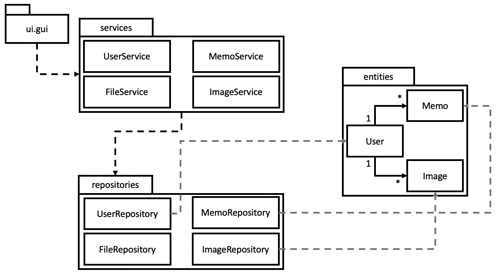

## Uuuden muistion luominen

Sekvenssikaaviossa kuvataan mitä tapahtuu käyttäjän painettua uuden muistion ikkunassa "Create"-nappia.

Käyttöliittymä kutsuu muistioiden sovelluslogiikassa muistioiden luomisesta vastaavaa create-metodia. Tämä metodi hakee ensin käyttäjien hakemisesta tietokantayhteyden ylitse vastaavalla get-metodilla muistion kirjoittajan. Tämän jälkeen create-metodi kutsuu muistioiden tietokantaan tallentamisesta vastaavaa new-metodia ja saa onnistuttua palautuksena tallennetun muistion. Tämän jälkeen tämä muistion id lisätään kirjoittajan muistioihin ja tallennetaan tietokantaan käyttäjien päivittämisestä vastaavalla update-metodilla. Lopuksi käyttöliittymä asettaa editorin muistioksi tallennetun muistion. Tarvittaessa vaihtaa vielä näkyväksi näkymäksi muistioeditorin.
