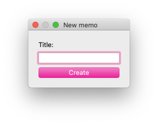

# Käyttöohje

Aloita lataamalla viimeisin [relase](https://github.com/FinThunderstorm/ohte/releases). Avaa terminaali/komentojana projektikansiosta.

## Asentaminen

1. Asenna sovelluksen tarvitsemat kirjastot komennolla:

```bash
poetry install
```

2. Käynnistä sovellus:

```bash
poetry run invoke start
```

3. Täytä asetustiedot avautuvaan ikkunaan. Tarvittavat tietokannan käyttäjätiedot, _username_ ja _password_, saat pyytämällä Telegramista _@finthunderstorm_.

## Konfiguraatiotiedosto .env

Sovellus luo tämän tiedoston ensimmäisellä käynnistyskerralla sovelluskansion juureen ja sen sisältöön voi vaikuttaa käyttämällä graafista asetustyökalua.

Tiedoston rakenne on seuraava:

```
RES_INDEX=1
RES_FORMAT=auto
DB_USERNAME=username
DB_PASSWORD=password
DB_SERVER=ohte.bu0r9.mongodb.net
DB_NAME=muistio
DATABASE_URI=mongodb+srv://${DB_USERNAME}:${DB_PASSWORD}@${DB_SERVER}/${DB_NAME}?retryWrites=true&w=majority
```

## Ohjelman käynnistäminen

Ohjelman suorittaminen tapahtuu komennolla `poetry run invoke start`. Ensimmäisellä käyttökerralla sovellus haluaa tarkistaa asetukset kohdilleen.

## Ensimmäinen käynnistys

Sovellus avautuu ensimmäisellä käynnistyskerralla asetusvalikkoon, jossa täydennetään tietokannan käyttäjätiedot ja valitaan haluttu resoluutio muistioiden käsittelemiselle.


## Kirjautuminen

Kirjautuminen sovellukseen tapahtuu täyttämällä käyttäjätiedot kenttiin ja painamalla "Login"-painiketta. Uuden käyttäjän voi luoda painamalla "create new user".


## Uuden käyttäjän luominen

Uuden käyttäjän luomiseksi täytä kaikki kentät. Käyttäjänimen tulee olla uniikki, ja sovellus antaa virheen annetun käyttäjänimen ollessa jo käytössä. Mikään kenttä ei voi olla tyhjä. Luodaksesi käyttäjän paina "Create". Mikäli et halua luoda käyttäjää, paina "Back to login".


## Muistion katseleminen

Muistion katseleminen tapahtuu valitsemalla haluttu muistio vasemmasta sivupalkista klikkaamalla oikean muistion otsikon kohdalta. Tästä näkymästä voidaan alapalkista löytyvillä työkaluilla muokata ("Edit"), poistaa ("Remove") tai viedä ("Export") muistion erilliseen Markdown-tiedostoon.

## Uuden muistion luominen

Uuden muistion luominen tapahtuu "New memo"-napin takaa. Muistioiden tuominen Markdown-tiedostosta tai verkkolähteestä tapahtuu "Import from"-napin takaa.

### Uusi muistio

Uuden perusmuistion luominen tapahtuu antamalla muistiolle otsikon. Mikäli jätät otsikon tyhjäksi, saa muistio oletusarvoisen otsikon. Luo muistio "Create"-napilla.



### Tuonti tiedostosta

Valitse tuotavan markdown-tiedoston sijainti "Select"-napilla. Annettuasi sijainnin, tuo muistio "Import"-napilla. Avautuu tuotu muistio muokkaustilassa.


### Tuonti verkosta

Liitä verkkosijainnin osoite kenttään ja tuo "Import"-napilla. Mikäli verkkolähteen osoite oli toimiva ja siitä pystyttiin parsimaan muistio, avautuu tämä muistio muokkaustilassa. Mikäli verkkosijainnin osoite oli virheellinen tai sieltä ei pystytty parsimaan sisältöä, avautuu virheilmoitus.


## Päävalikko

"Main menu"-napin takaa löytyy sovelluksen päävalikko, josta pääsee asetuksiin ("Settings") ja pystyy kirjautumaan sovelluksesta ulos ("Log out").


## Muistion muokkaaminen

Muistion muokkaamistilassa voidaan muistion otsikkoa ja sisältöä muuttaa. Alapalkista löytyy muokkauksien tallentamisen ("Save") ja keskeyttämisen ("Cancel") toiminnallisuudet sekä kuvien lisäämistoiminnallisuus ("Add image"). Muistion tekstimuokkain tukee Markdown-muotoilua.


## Kuvan lisääminen muistioon

Muistioon voidaan lisätä sekä jo järjestelmään aiemmin vietyjä kuvia tai tuoda tiedostosta uuden kuvan. Kuvan täytyy olla joko png, jpg, jpeg tai svg -muotoinen. Kuva asetetaan tekstin osoittimen mukaiseen kohtaan. Mikäli osoitin ei ole tekstissä aktiivinen, lisätään kuva muistion ensimmäiseksi. Mikäli lisäät käsin tekstin joukkoon kuvan käyttäen Markdown-syntaksia, toimimaton kuvan tunniste piirtää pienen virheilmoitus kuvan muistioon.

### Uuden kuvan tallentaminen

Lisätäksesi uuden kuvan valitse "Add new"-välilehti. Tämän jälkeen valitse kuvan tiedostosijainti "Select"-napilla. Tämän jälkeen määritä kuvalle nimi ja leveys, jolla kuva ilmenee muistiossa. Leveyden tulee olla kokonaisluku väliltä 0-7680. Mikään kentistä ei saa olla tyhjä. Tuo järjestelmään "Add"-napilla. Tämän jälkeen kuva lisätään automaattisesti tekstiin tekstin osoittimen mukaiseen kohtaan.


### Jo tallennetun kuvan lisääminen

Jo tallennetun kuvan lisääminen tekstin osoittimen mukaiseen kohtaan tapahtuu "Select"-napilla. "Remove"-napilla voi järjestelmässä olevan kuvan poistaa. Kuvan tietoja voi muokata "Edit"-napilla. "Close"-napilla voi sulkea valintaruudun.


### Jo tallennetun kuvan tietojen muokkaaminen

Täytä muuttuneet kentät ja tallenna muutokset "Save"-napilla. Jos muutoksia ei ole, pystyt palaamaan takaisin "Save"-napilla.


## Asetukset

Ohjelman asetuksia voi hallita päävalikosta löytyvän "Settings"-napin takaa. Valikosta voi hallita käyttäjätietoja sekä tietokantayhteyden asetuksia. Tietokantayhteyden ja näyttöasetuksien muutokset hyväksytään ylemmällä "Save"-napilla. Käyttäjämuutokset hyväksytään alemmalla "Save"-napilla. Käyttäjän voi poistaa "Remove"-napilla. Muutokset voi peruuttaa "Cancel"-napeilla.


