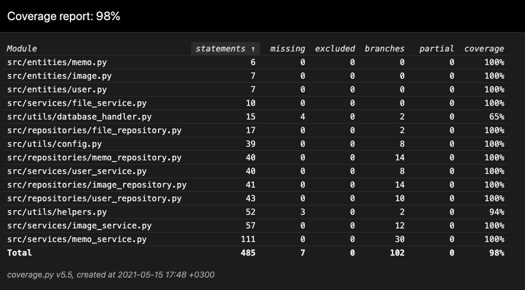

# Testausdokumentti

Sovelluksen testaaminen suoritetaan sovelluslogiikan ja tietokannan kanssa keskustelevien luokkien osin automatisoiduilla yksikkö- ja integraatiotestein ja käyttöliittymän osin manuaalisesti tapahtunein testein.

## Yksikkö- ja integraatiotestaus

### Tietokannan kanssa keskustelevat luokat (Repositoryt)

Tietokannan kanssa keskustelevien luokkien `MemoRepository`, `FileRepository` ja `UserRepository` testaus suoritetaan vastaavilla luokilla `TestMemoRepository`, `TestFileRepository` ja `TestUserRepository`.

Luokan `ImageRepository` testaus suoritetaan vastaavan sovelluslogiikan luokan `ImageService` testausluokan `TestImageService` kautta johtuen kuvien käsittelemisestä tietokantaan tallennettavaan muotoon. Poistamistoiminnallisuus tietokannasta jo poistetun kuvan osalta testataan testausluokassa `TestImageRepository`, koska `ImageService` tarkastaa poistettaessa, että kuva on jo tietokannassa.

Tietokantayhteys mallinnetaan yhdistämällä tuotantotietokannan sijasta _mongomock_-kirjaston tarjoamaan mallinnukseen tuotantotietokantaa vastaavasta tietokannasta.

### Sovelluslogiikka

### Testauskattavuus

Testien haaraumakattavuus on 98%, kun huomioon ei oteta testejä ja käyttöliittymäkerrosta.

Testauksen ulkopuolella on tietokantayhteydestä vastaavan tiedosto [_database_handler.py_](https://github.com/FinThunderstorm/ohte/blob/master/src/utils/database_handler.py) ja testien sekä käyttöliittymän aputyökaluista vastaava tiedosto [_helpers.py_](https://github.com/FinThunderstorm/ohte/blob/master/src/utils/helpers.py). Näiden kohdalla testauskattavuuden ulkopuolelle jättämistä olisi voitu harkita.

## Käyttöliittymän testaus

Käyttöliittymän testaus on suoritettu manuaalisesti käyttäen sekä macOS-, että Ubuntu-käyttöjärjestelmiä. Sovelluksessa on kokeiltu myös eri konfiguraatiotiedoston arvojen vaikutukset.

Sovellusta on kokeiltu noudattamalla käyttöohjeiden antamia ohjeita sovelluksen asentamisesta ja myös tilanteissa, joissa konfiguraatiotiedostoa ei ole luotu ennen ensimmäistä käyttökertaa.

Kaikki sovelluksen käyttöohjeiden mukaiset päätoiminnallisuudet on testattu ja todettu toimiviksi. Myös virheellisten syötteiden antamista on testattu.

## Sovelluksen laatuongelmat

Sovelluksessa on pylintin osalta tehty seuraavat poikkeamat:

- MemoRepositoryn rivillä 30, ImageRepositoryn rivillä 30 ja UserRepositoryn rivillä 35 on pylint poistettu käytöstä no-memberin osalta, koska pylint ei ymmärrä mongoenginen alaluokan omaavan tälläistä objects-arvoa, jonka Memon pääluokka Document tarjoaa.
