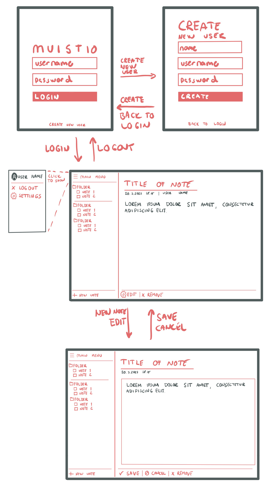

# Vaatimusmäärittely

## Tarkoitus

Sovelluksen on tarkoitus toimia käyttäjän omana muistikirjana useammmalla laitteella verkon ylitse. Muistikirjat ovat yksilöllisiä ja jokaisella käyttäjällä on oma muistikirja.

## Käyttäjät

Sovelluksessa on ensimmäisessä vaiheessa yhden tasoisia käyttäjiä, eli peruskäyttäjiä - tilannetta tarkastellaan projektin edetessä uudelleen.

## "Tech stack"

- Python 3.6 tuki
  - PyQt5 -graafinen kirjasto
- MongoDB -tietokanta taustalla

## Käyttöliittymähahmotelma

## Ensimmäisen vaiheen tarjoamat toiminnallisuudet

### Käyttäjänhallinta

- Käyttäjä voi kirjautua järjestelmään (tehty)
- Käyttäjä voi luoda itselleen tunnuksen järjestelmään (tehty)
- Käyttäjä voi kirjautua ulos järjestelmästä (tehty)

### Muistion toiminnallisuudet

- Käyttäjä voi lukea muistioita (tehty)
- Käyttäjä voi luoda muistion (tehty)
- Käyttäjä voi muokata muistiota (tehty)
- Käyttäjä voi poistaa muistion (tehty)

## Jatkokehittämismahdollisuudet

Ensimmäisen vaiheen jälkeen ohjelmaa voidaan lähteä jatkokehittämään seuraavien toiminnallisuuksien pohjalta.

- Markdown-muotoilulle tuki käyttäen [markdown2-kirjastoa](https://github.com/trentm/python-markdown2) (tehty)
  - taulukkotuki, listatuki, checklist tuki lisätty
- Tyylittely, vakiotyyli tarvitsee parannusta
- Muistioiden lajitteleminen kansioittain + värikoodit kansioille, selvitettävä ikonien käyttö
- Lajittelumahdollisuudet
- Median upottaminen
- Mahdollisuus tuoda/viedä Markdown-muotoiltuja tiedostoja
- Asetukset
- Käyttäjähallinta
- Muistikirjan jakaminen toiselle käyttäjälle
- Muistutusjärjestelmä, muistiolle voidaan asettaa aika, jolloin käyttäjä saa siitä sovelluksessa ilmoituksen.
- Verkkosisällön tallentaminen muistioon Python kirjaston [trafilatura](https://trafilatura.readthedocs.io/en/latest/) avulla
